# LK 01: Lingkungan Praktik Mandiri + Ujicoba Messaging Protocols ([Brone](https://brone.ub.ac.id/mod/assign/view.php?id=124118))
- Referensi https://github.com/abazh/dist_sys

1. Buat Lingkungan Praktik Mandiri berbasis VSCode+GitHub Copilot, WSL2 + Ubuntu, Docker Container
2. Fork Repository Program: https://github.com/abazh/dist_sys ke dalam akun Github anda
3. Lakukan ujicoba per protocol dan modifikasi yang diperlukan
4. Buat laporannya dalam respository akun Github anda (bisa private/tidak harus public)
5. Invite akun abazh@ub.ac.id ke repository anda.
6. Submit link ke repository anda ke Tugas ini.

# Report
## 1. Ujicoba REST
1. Mengikuti langkah - langkah yang ada pada Instruksi. \

- Hasil mengikuti Instruksi
    1. Menjalankan perintah:
        ```
        docker compose -f compose/rest.yml up -d
        ```
        
    2. Menjalankan perintah:
        ```
        docker compose -f compose/rest.yml exec rest-server python server.py
        ```
        
    3. Menjalankan perintah:
        ```
        docker compose -f compose/rest.yml exec rest-client python client.py --op both -a 2 -b 3
        ```
        

2. Memodifikasi source code
    1. Mengubah client.py
        1. Menambahkan fungsi call_calc(expr) \
        
        2. Memodifikasi main function \
        
    2. Mengubah server.py
        1. Import sympy \
        
        2. Menambahkan fungsi calc_expression \
        
    3. mengubah requirement.txt
        1. Menambahkan sympy kedalam library \
        

3. Menjalankan source code yang sudah termodifikasi
    1. Menjalankan perintah:
        ```
        docker compose -f compose/rest.yml up -d
        ```
        
    2. Menjalankan perintah:
        ```
        docker compose -f compose/rest.yml exec rest-server python server.py
        ```
        
    3. Menjalankan perintah:
        ```
        docker compose -f compose/rest.yml exec rest-client python client.py --op calc --expr "(10/2)+7*3"
        ```
        


## 2. Ujicoba Reqresp
1. Mengikuti langkah - langkah yang ada pada Instruksi. \

- Hasil mengikuti instruksi
    1. Menjalankan perintah:
        ```
        docker compose -f compose/reqresp.yml up -d
        ```
         \
        
    2. Menjalankan perintah:
        ```
        docker compose -f compose/reqresp.yml exec reqresp-server python server.py
        ```
        
    3. Menjalankan perintah:
        ```
        docker compose -f compose/reqresp.yml exec reqresp-client python client.py
        ```
        
    4. Mencoba tcp reqresp \
    
    5. Mencoba tcp reqresp dengan dibaca tcp-dump \
    
    6. Mencoba tcp reqresp dibaca tcp-dumb dan wireshark \
     \
     \
    

## 3. Ujicoba JSON-RPC
1. Mengikuti langkah - langkah yang ada pada Instruksi. \
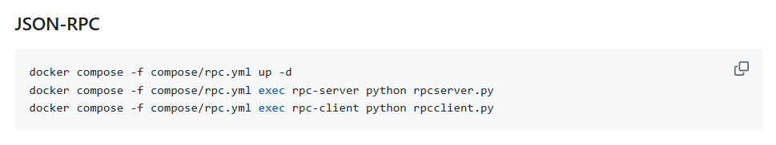
- Hasil mengikuti instruksi
    1. Menjalankan perintah:
        ```
        docker compose -f compose/rpc.yml up -d
        ```
        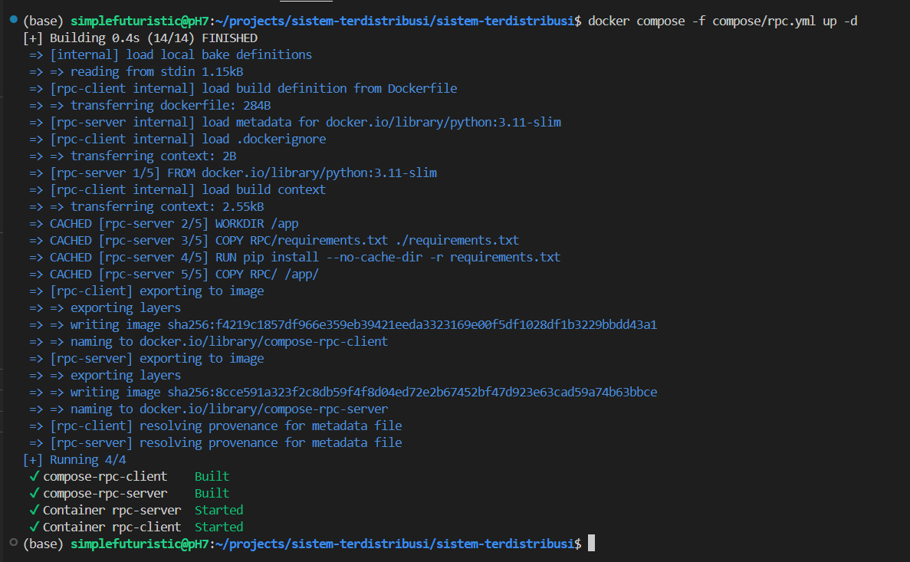
    2. Menjalankan perintah:
        ```
        docker compose -f compose/rpc.yml exec rpc-server python rpcserver.py
        ```
        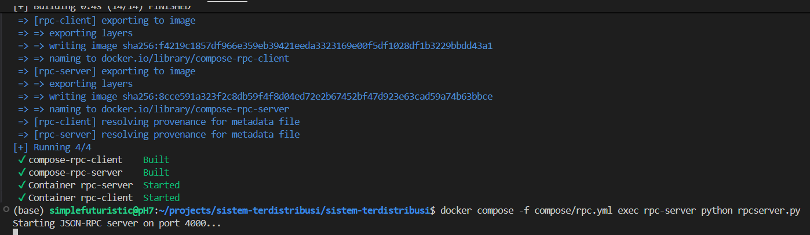
    3. Menjalankan perintah:
        ```
        docker compose -f compose/rpc.yml exec rpc-client python rpcclient.py
        ```
        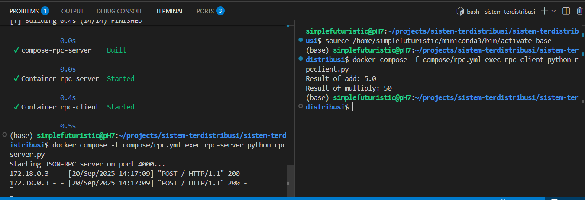

2. Memodifikasi source code
    1. mengubah requirement.txt \
    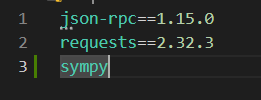
    2. Mengubah rpcserver.py
        1. Menambahkan fungsi calc(expr: str) \
        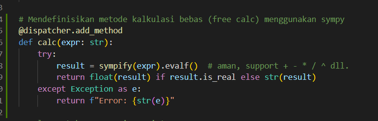
    3. Mengubah rpcclient.py
        1. Menambahkan panggilan operasi kalkulasi bebas \
        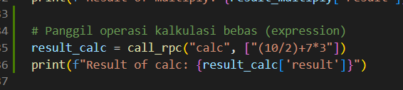

3. Menjalankan source code yang sudah termodifikasi
    1. Menjalankan perintah:
        ```
        docker compose -f compose/rpc.yml up -d
        ```
        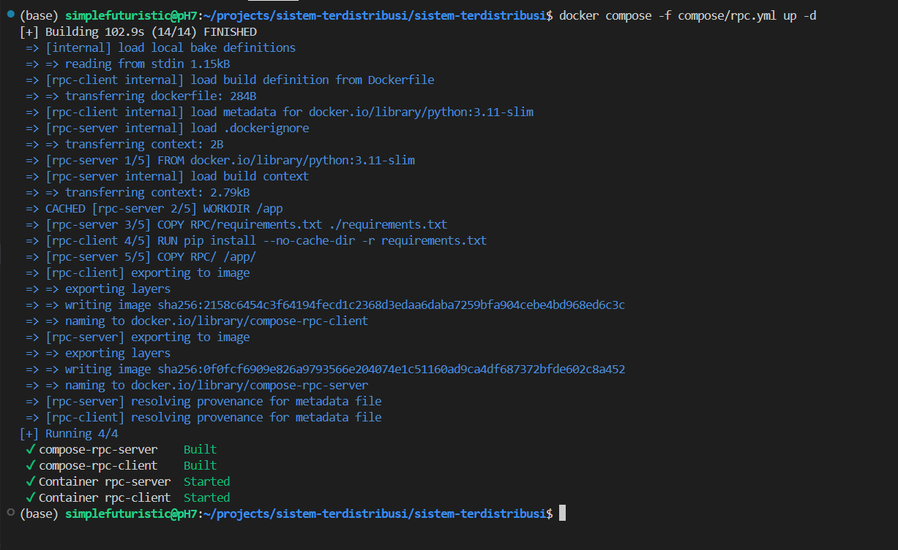
    2. Menjalankan perintah:
        ```
        docker compose -f compose/rpc.yml exec rpc-server python rpcserver.py
        ```
        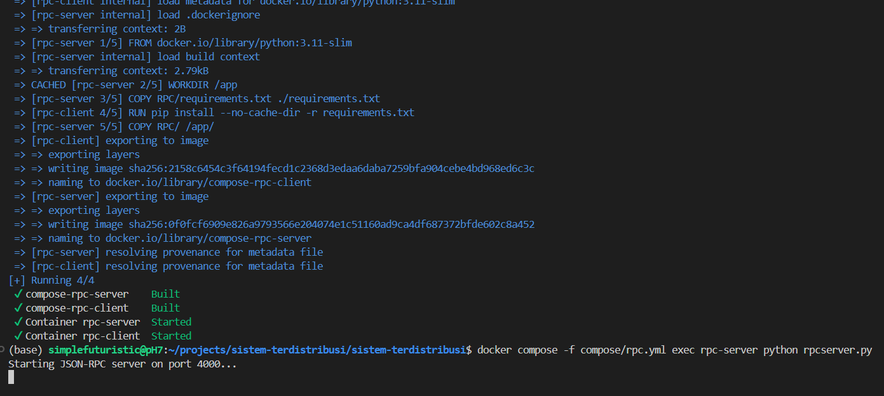
    3. Menjalankan perintah:
        ```
        docker compose -f compose/rpc.yml exec rpc-client python rpcclient.py
        ```
        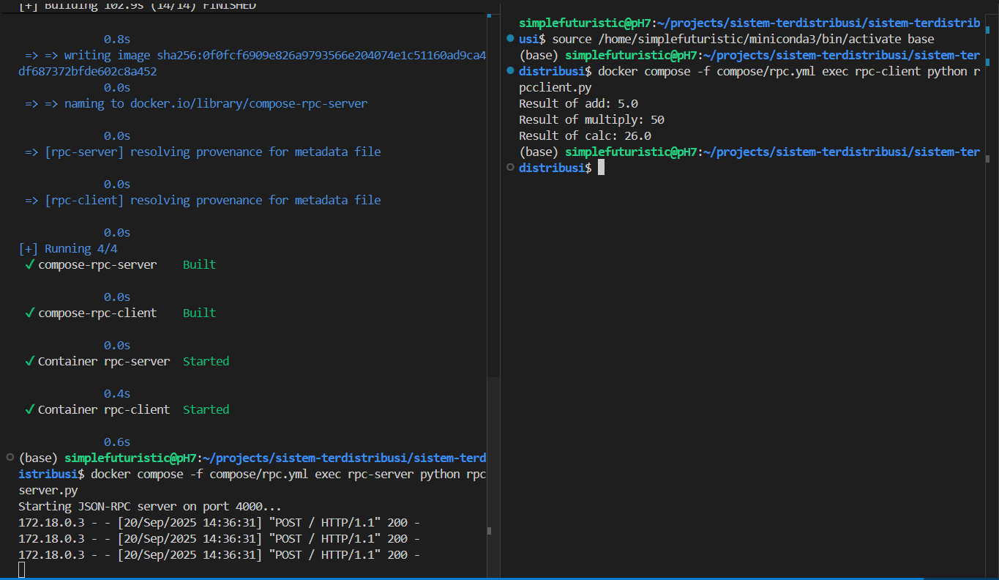

## 4. Ujicoba SOAP
1. Mengikuti langkah - langkah yang ada pada Instruksi. \
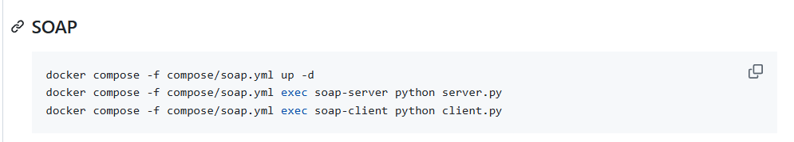
- Hasil mengikuti Instruksi
    1. Menjalankan perintah:
        ```
        docker compose -f compose/soap.yml up -d
        ```
        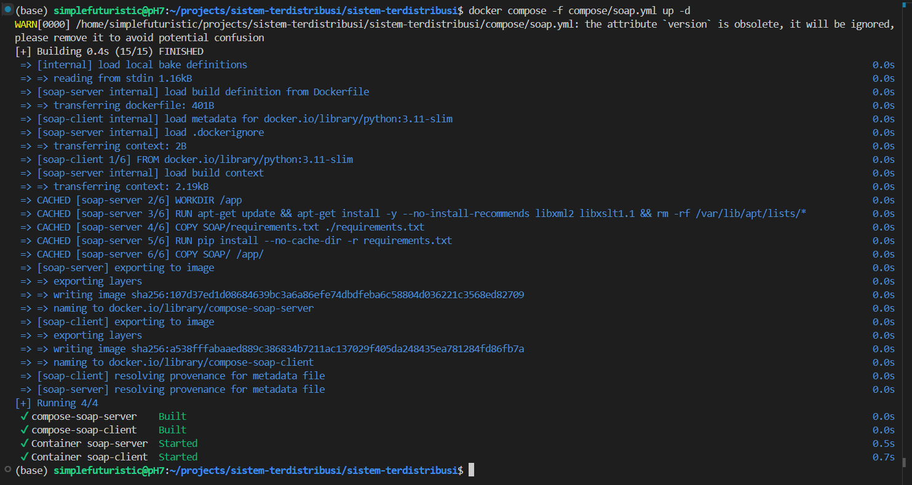
    2. Menjalankan perintah:
        ```
        docker compose -f compose/soap.yml exec soap-server python server.py
        ```
        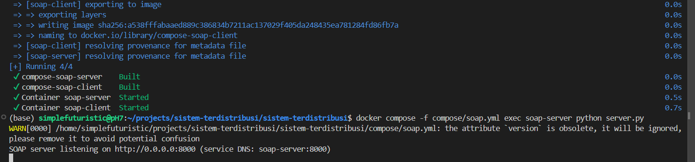
    3. Menjalankan perintah:
        ```
        docker compose -f compose/soap.yml exec soap-client python client.py
        ```
        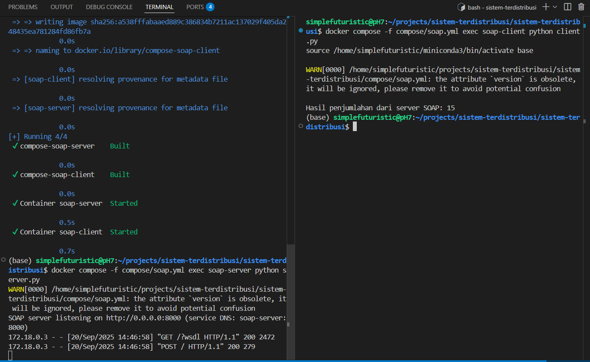

2. Memodifikasi source code
    1. Mengubah server.py
        1. Menambahkan import sympy dan menambahkan Unicode dan Double dari spyne \
        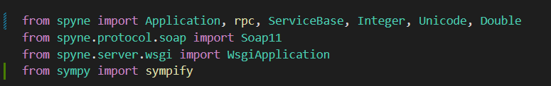
        2. Menambahkan fungsi kalkulasi bebas pada kelas CalculatorService \
        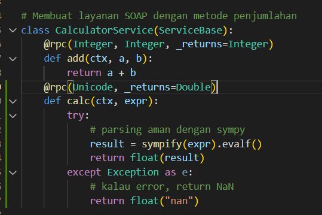
    2. Mengubah client.py
        1. Menambahkan pengujian kalkulasi bebas (2 kalkulasi) \
        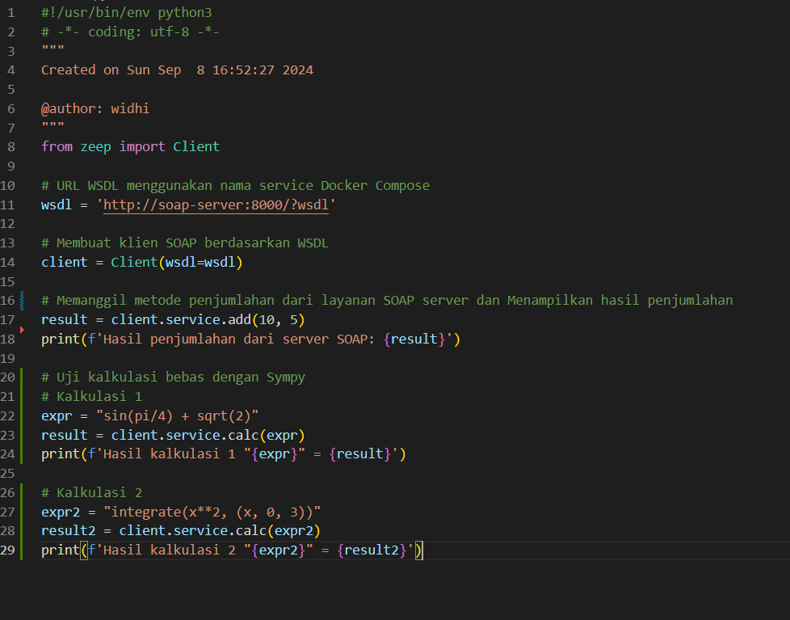
    3. mengubah requirement.txt
        1. Menambahkan sympy kedalam library \
        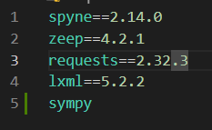

3. Menjalankan source code yang sudah termodifikasi
    1. Menjalankan perintah:
        ```
        docker compose -f compose/soap.yml up -d
        ```
        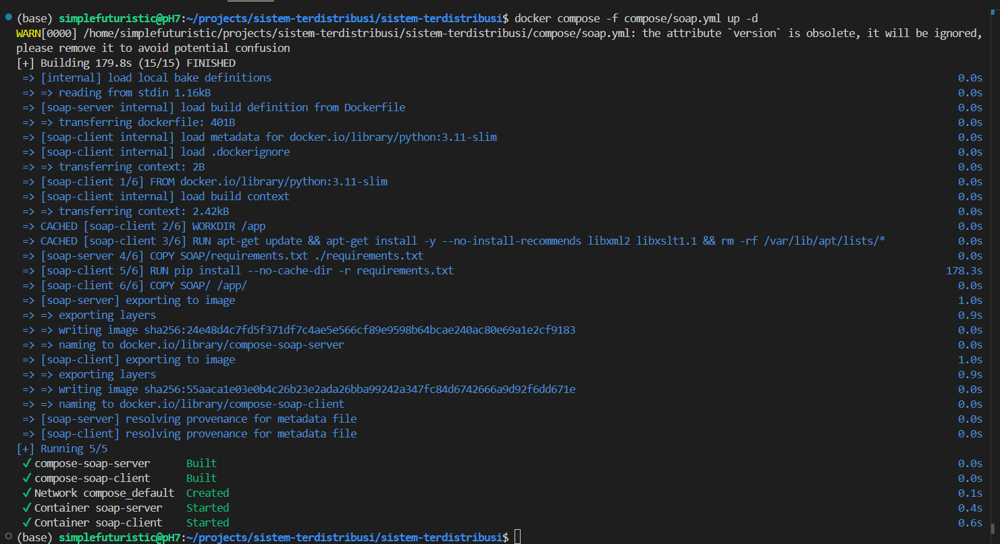
    2. Menjalankan perintah:
        ```
        docker compose -f compose/soap.yml exec soap-server python server.py
        ```
        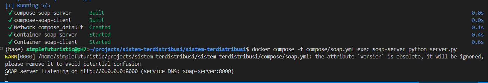
    3. Menjalankan perintah:
        ```
        docker compose -f compose/soap.yml exec soap-client python client.py
        ```
        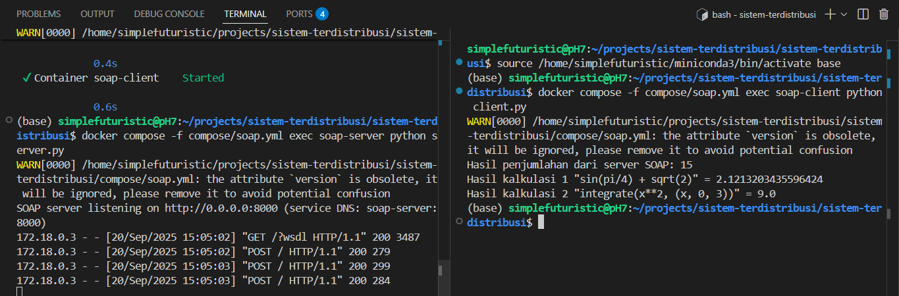

## 5. Ujicoba MQTT
1. Mengikuti langkah - langkah yang ada pada Instruksi. \
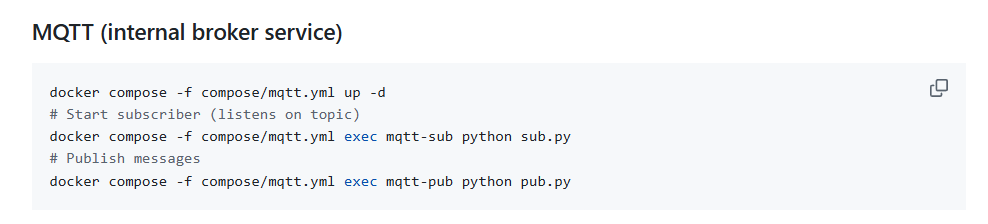
- Hasil mengikuti Instruksi
    1. Menjalankan perintah:
        ```
        docker compose -f compose/mqtt.yml up -d
        ```
        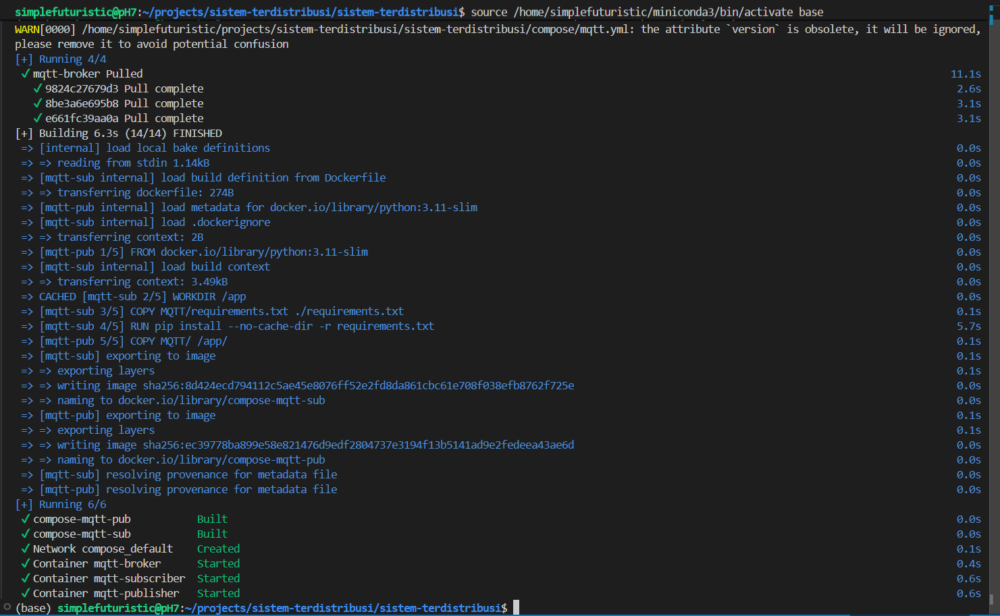
    2. Menjalankan perintah:
        ```
        docker compose -f compose/mqtt.yml exec mqtt-sub python sub.py
        ```
        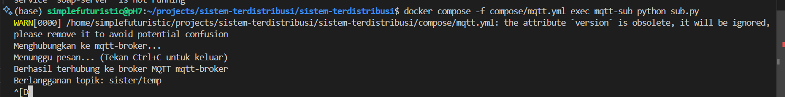
    3. Menjalankan perintah:
        ```
        docker compose -f compose/mqtt.yml exec mqtt-pub python pub.py
        ```
        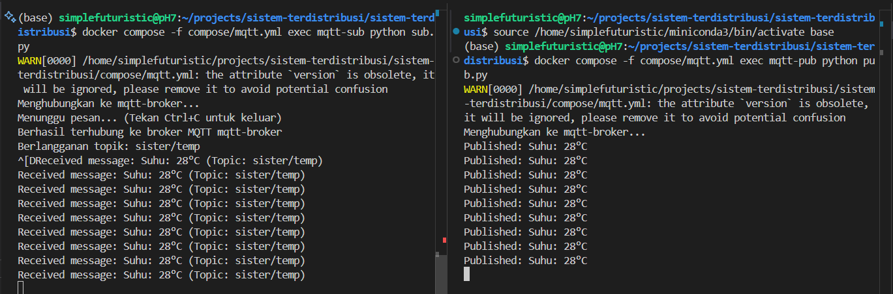

## 6. Ujicoba UDP One-way
1. Mengikuti langkah - langkah yang ada pada Instruksi. \
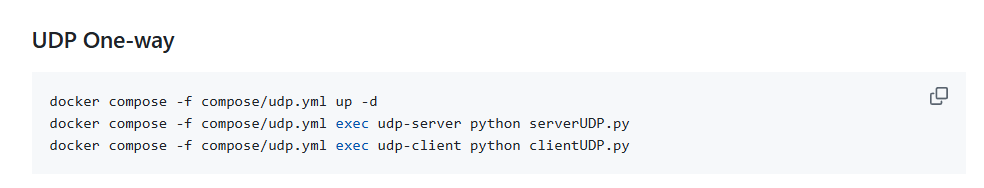
- Hasil mengikuti Instruksi
    1. Menjalankan perintah:
        ```
        docker compose -f compose/udp.yml up -d
        ```
        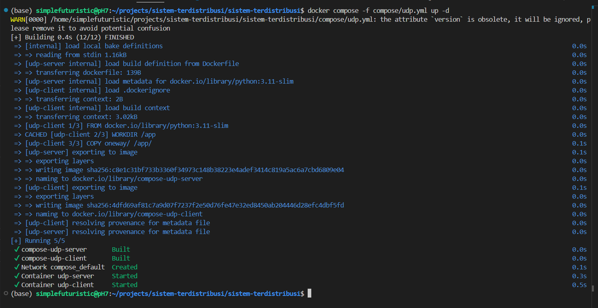
    2. Menjalankan perintah:
        ```
        docker compose -f compose/udp.yml exec udp-server python serverUDP.py
        ```
        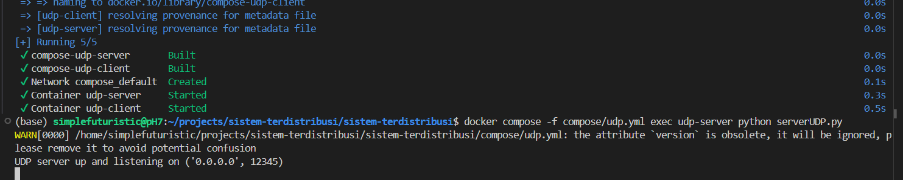
    3. Menjalankan perintah:
        ```
        docker compose -f compose/udp.yml exec udp-client python clientUDP.py
        ```
        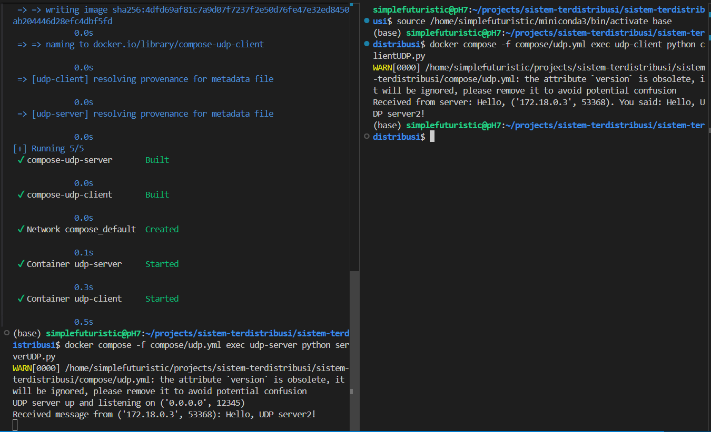

2. Memodifikasi source code
    1. Mengubah clientUDP.py
        1. Menambahkan pesan ektra kepada server \
        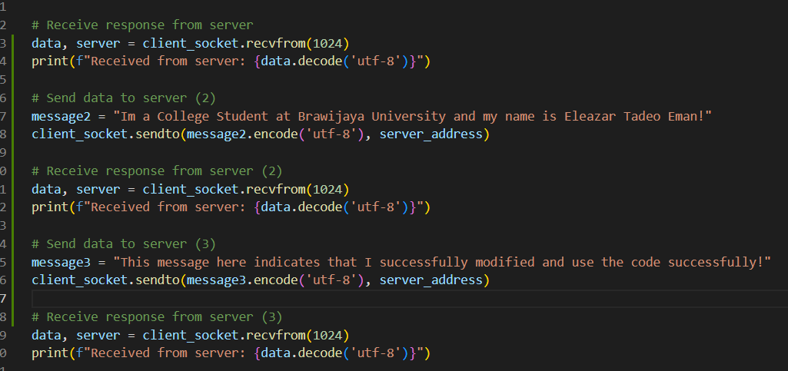

3. Menjalankan source code yang sudah termodifikasi
    1. Menjalankan perintah:
        ```
        docker compose -f compose/udp.yml up -d
        ```
        
    2. Menjalankan perintah:
        ```
        docker compose -f compose/udp.yml exec udp-server python serverUDP.py
        ```
        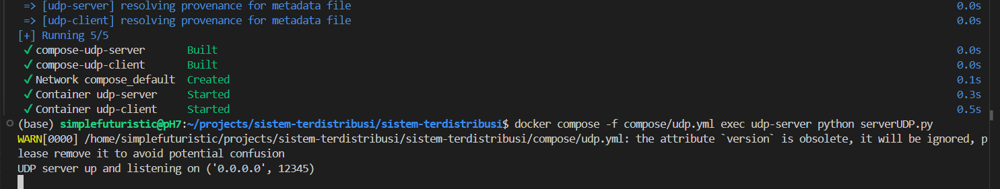
    3. Menjalankan perintah:
        ```
        docker compose -f compose/udp.yml exec udp-client python clientUDP.py
        ```
        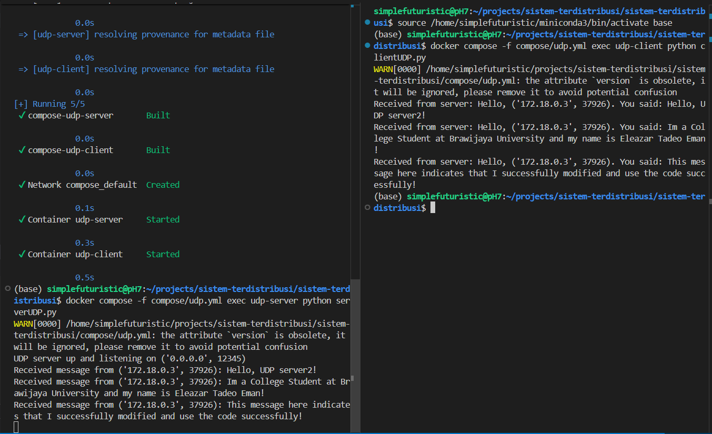