# LK 01: Lingkungan Praktik Mandiri + Ujicoba Messaging Protocols ([Brone](https://brone.ub.ac.id/mod/assign/view.php?id=124118))
- Referensi https://github.com/abazh/dist_sys

1. Buat Lingkungan Praktik Mandiri berbasis VSCode+GitHub Copilot, WSL2 + Ubuntu, Docker Container
2. Fork Repository Program: https://github.com/abazh/dist_sys ke dalam akun Github anda
3. Lakukan ujicoba per protocol dan modifikasi yang diperlukan
4. Buat laporannya dalam respository akun Github anda (bisa private/tidak harus public)
5. Invite akun abazh@ub.ac.id ke repository anda.
6. Submit link ke repository anda ke Tugas ini.

# Report
## 1. Ujicoba REST
1. Mengikuti langkah - langkah yang ada pada Instruksi. \
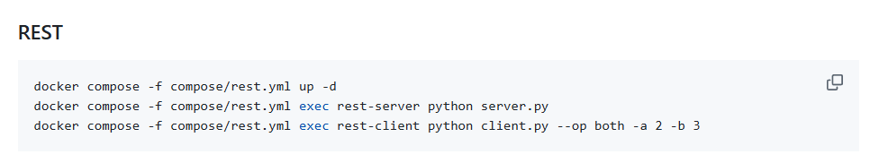
- Hasil mengikuti Instruksi
    1. Menjalankan perintah docker compose -f compose/rest.yml up -d
    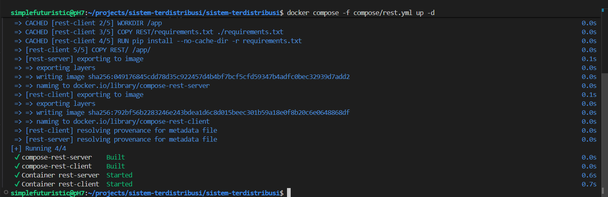
    2. Menjalankan perintah docker compose -f compose/rest.yml exec rest-server python server.py
    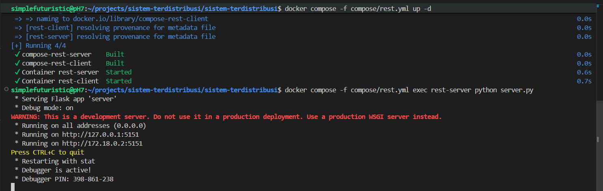
    3. Menjalankan perintah docker compose -f compose/rest.yml exec rest-client python client.py --op both -a 2 -b 3
    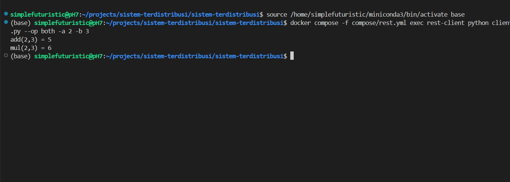

2. Memodifikasi source code
    1. Mengubah client.py
        1. Menambahkan fungsi call_calc(expr) \
        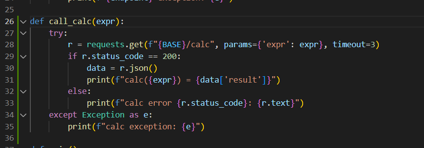
        2. Memodifikasi main function \
        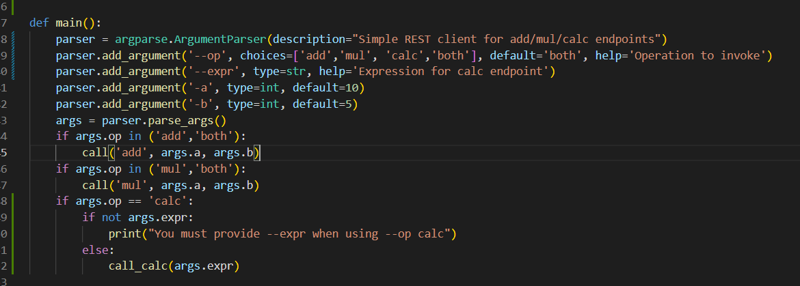
    2. Mengubah server.py
        1. Import sympy \
        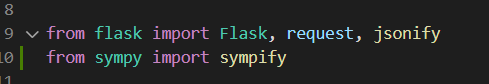
        2. Menambahkan fungsi calc_expression \
        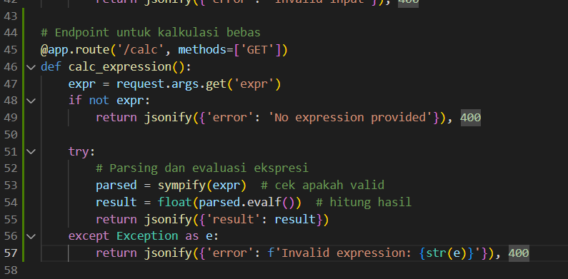
    3. mengubah requirement.txt
        1. Menambahkan sympy kedalam library \
        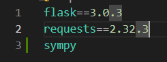

3. Menjalankan source code yang sudah termodifikasi
    1. Menjalankan perintah docker compose -f compose/rest.yml up -d
    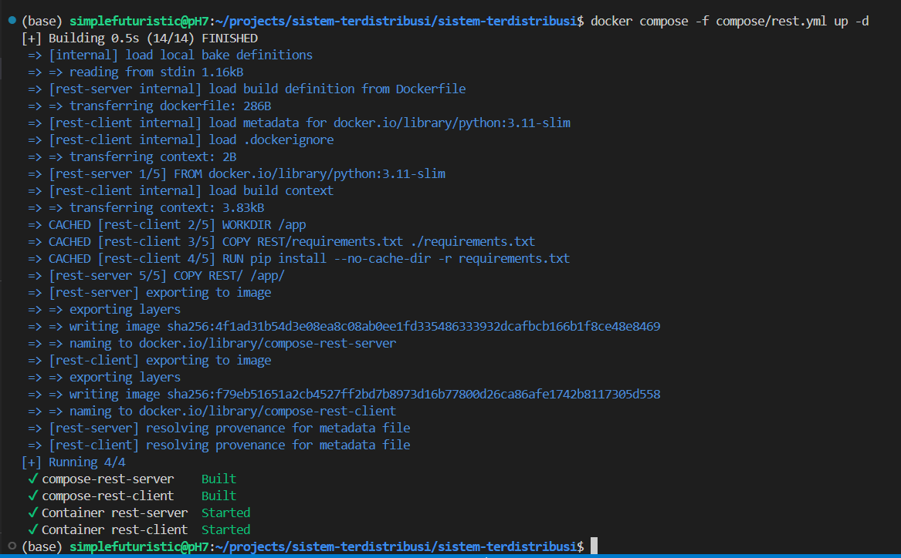
    2. Menjalankan perintah docker compose -f compose/rest.yml exec rest-server python server.py
    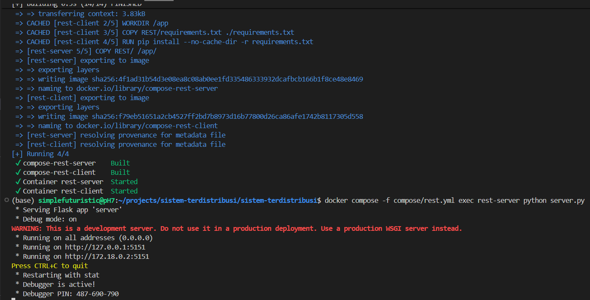
    3. Menjalankan perintah docker compose -f compose/rest.yml exec rest-client python client.py --op calc --expr "(10/2)+7*3"
    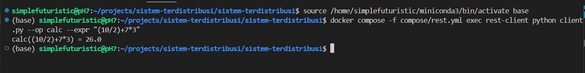

## 2. Ujicoba Reqresp
1. Mengikuti langkah - langkah yang ada pada Instruksi. \

- Hasil mengikuti instruksi
    1. Menjalankan perintah docker compose -f compose/reqresp.yml up -d \
    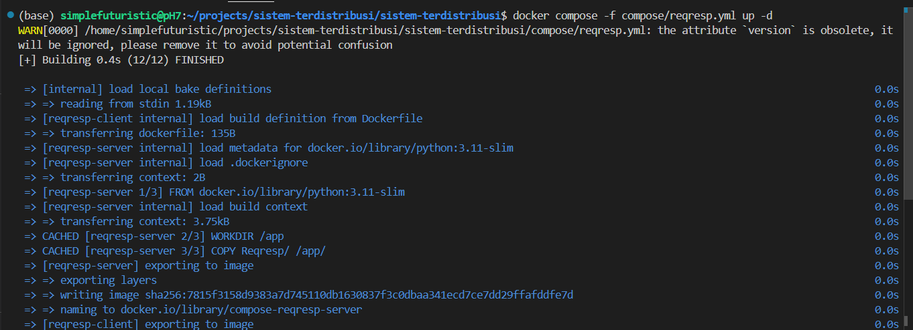
    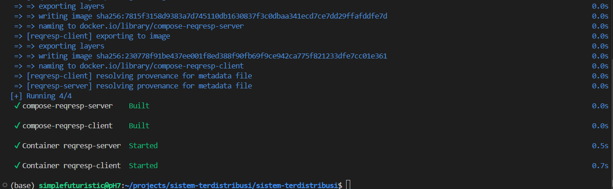
    2. Menjalankan perintah docker compose -f compose/reqresp.yml exec reqresp-server python server.py \
    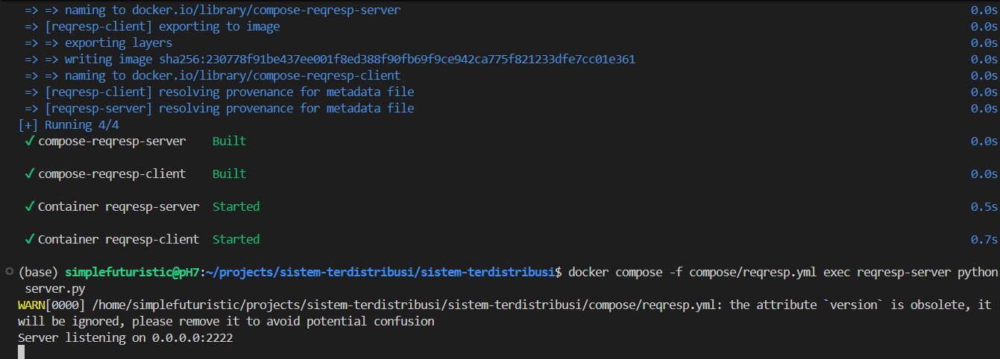
    3. Menjalankan perintah docker compose -f compose/reqresp.yml exec reqresp-client python client.py \
    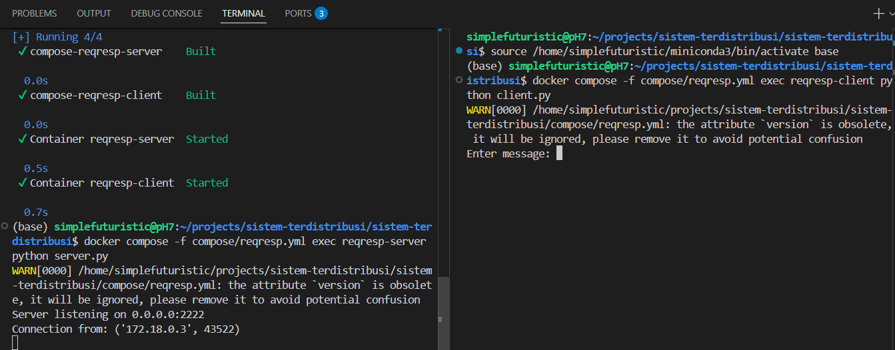
    4. Mencoba tcp reqresp \
    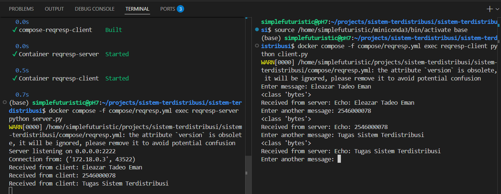
    5. Mencoba tcp reqresp dengan dibaca tcp-dump \
    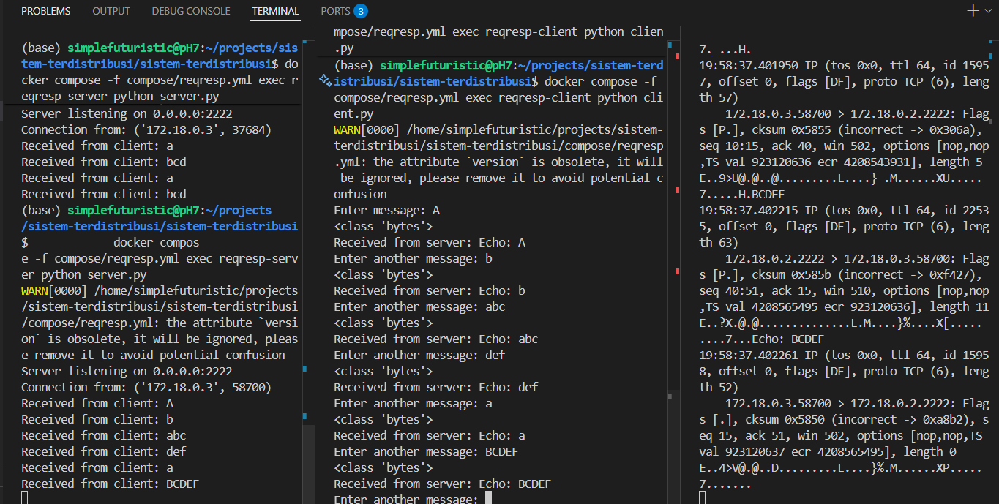
    6. Mencoba tcp reqresp dibaca tcp-dumb dan wireshark \
    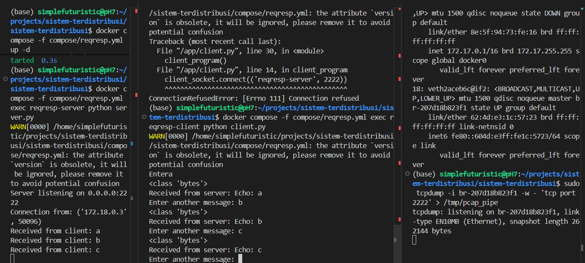
    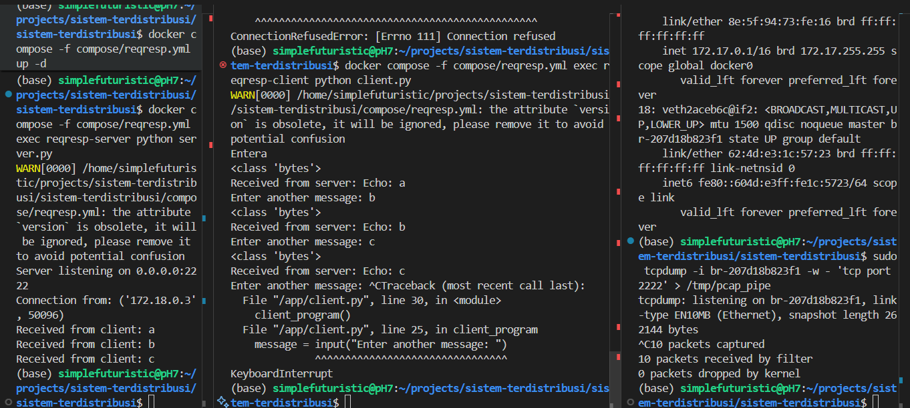
    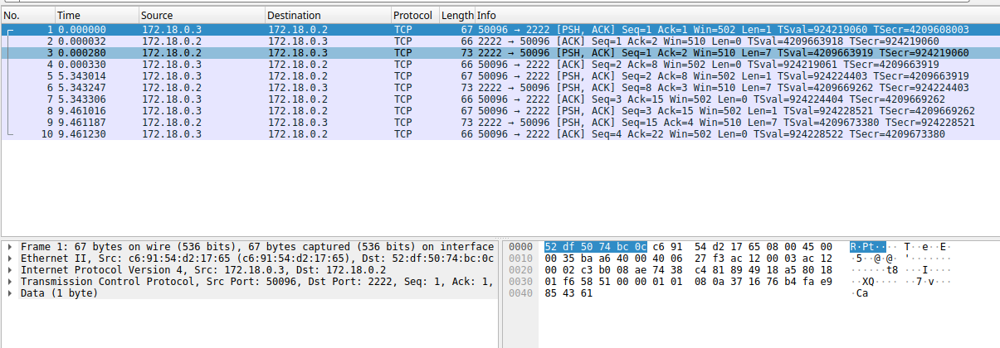